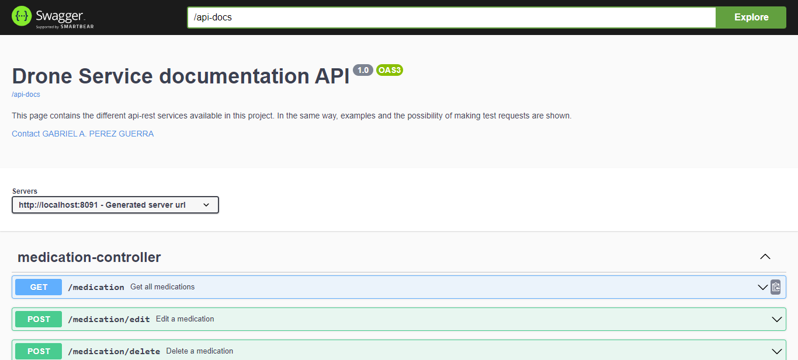
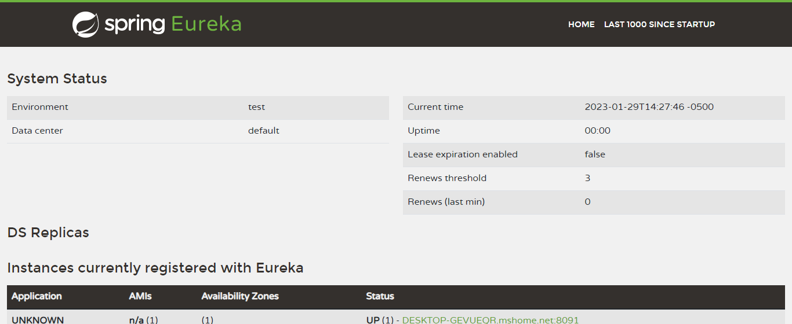
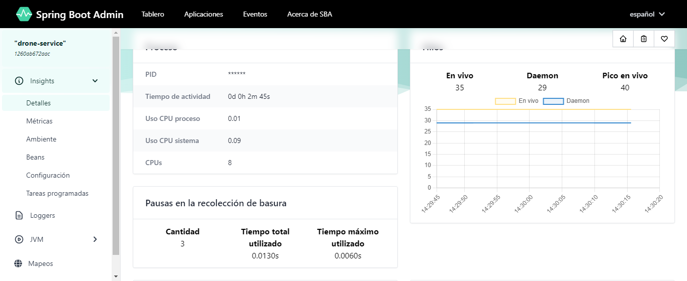

# Drone - Backend

This project has been developed with the purpose of taking control of a fleet of drones in charge of transporting Medications. It has been developed in Java (with Maven) using the environment provided by SpringBoot.
It is made up of a main project, which contains the link to three other projects. These three mentioned projects are:
   - **drone-service:** Main service for the control of the drone fleet. SpringBoot, an embedded server and an H2 database with initial data for queries have been developed.
   - **registry-service:** Service in charge of recording drone-service status changes. It is developed with Eureka Server.
   - **admin-service:** Service in charge of monitoring the operation of drone-service. It constitutes a website developed with Spring Admin.

When starting services it is important to note the boot order. These should start in the following order:
1. registry-service
2. admin-service
3. drone-service

These services have been developed with <code>Java 17</code> and <code>Spring Boot 3.0.3</code>.

## Compiling and starting the services

To compile any of these services you can use Maven tasks. These tasks can be executed individually by being located in each one of the subprojects or from the root of the main project (the main project includes all the subprojects since they are incorporated as submodules of it). You can use the following command:
```bash
$ mvn clean package install
```

To run the services you can run the following command:
```bash
$ mvn spring-boot:run
```

On the other hand, you can also run the .jar files generated from each of the projects with the following command:
```bash
$ java -jar target\<filename>
```

## Docker Deploy

### Deploy with DockerFile
In the root directory of each of the projects you can find two DockerFile files with which you can generate a container to run the service. In the case of DockerFile files, they contain the compilation process inside a temporary container and in the case of DockerFileDev files, the process must be carried out outside the container to later move the compilation to the container.
To run these files you should run the following commands:
- **registry-service:** `docker run -p 8761:8761 <DockerFileName>`
- **admin-service:** `docker run -p 8086:8086 <DockerFileName>`
- **drone-service:** `docker run -p 8091:8091 <DockerFileName>`

### Deploy with Docker-Compose
One way to simplify this process is by using DockerCompose. In the root directory of the project there are the files docker-compose and docker-compose-dev through which the project can be deployed using docker in a simplified way. In the first case, the 3 services will be deployed by compiling them in a temporary container and in the second case, the compiled files are selected from the root of the project and executed on a virtual server.
```shell
docker-compose up --build docker-compose.yml
```

## Services Execution

Once the services have been executed, the following URLs will be available:
- http://localhost:8091/swagger-ui/index.html : This URL contains a web page that shows the information of each of the endpoints available in drone-service documented with Swagger. It contains information on the structure of the requests and responses that these endpoints accept.
- http://localhost:8761: Contains the website of the Eureka Server, which allows you to follow the status of the drone-service..
- http://localhost:8086 : Contains the Spring Admin web interface. This service allows you to view the drone-service status.

### Swagger interface with some of the available web services.


### Eureka Server interface.


### Spring Boot Admin Interface.
